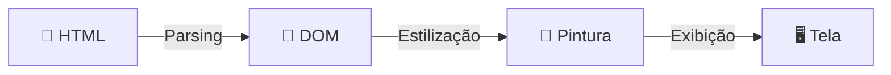

# O Navegador e o HTML 🖥️

O navegador funciona como um intérprete que transforma código em visual.

## O Processo de Renderização

 

 

<v-clicks>

- **1. Parsing:** O navegador lê o arquivo HTML linha por linha.
- **2. DOM (Document Object Model):** Cria uma estrutura em memória em forma de árvore.
- **3. Pintura:** Aplica estilos (CSS) e desenha os pixels na tela.

</v-clicks>
