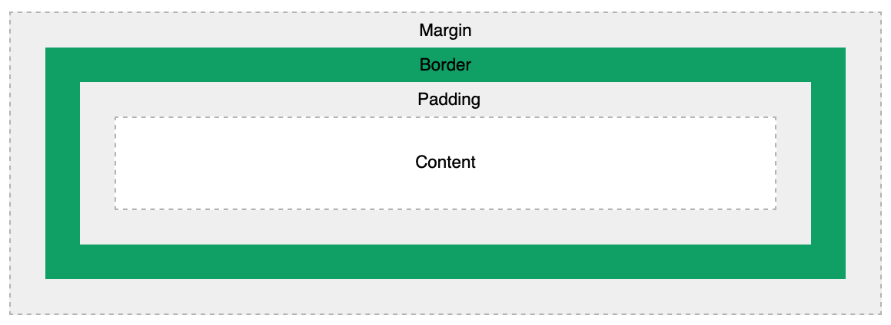

# 3. Box Model (O Modelo de Caixa)

Todo elemento HTML é, no fundo, uma caixa retangular. Entender o **Box Model** é crucial para criar layouts.

- **Content (Conteúdo):** Onde o texto ou imagem aparece (controlado por `width` e `height`).
- **Padding (Preenchimento):** Espaço transparente *dentro* da caixa, ao redor do conteúdo.
- **Border (Borda):** A linha de contorno da caixa (entre o padding e a margin).
- **Margin (Margem):** Espaço livre *externo* que empurra outros elementos para longe.
